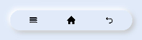

# Neumorphism_Navbar
一Neumorphism Navigation Bar design for OpenHarmony.

## Download & Install

Install using npm

```npm i hmos-neumorphism ```
Details about OpenHarmony NPM environment configuration, see at [here](https://gitee.com/openharmony-tpc/docs/blob/master/OpenHarmony_npm_usage.md)

## Usage Instructions
# Note :

Add this css snippet when passing input or button through slot .

```css
button, input{
    width: 100%;
    height: 100%;
    background-color:transparent;
    color: black;
}
```

# Navbar



Import:
```html
<element name='neunavbar' src='hmos-neumorphism/navbar/navbar.hml'></element>
```

Usage:
```html
<neunavbar  width="300px" height="50px" border="50px" @right-event="buttonClick" @middle-event="buttonClick" @left-event="buttonClick">
  <image slot="first" src="common/icons/recent.png" style="width:20px; height: 20px;" ></image>
  <image slot="second" src="common/icons/home.png" style="width:20px; height: 20px;" ></image>
  <image slot="third" src="common/icons/return.png" style="width:20px; height: 20px;" ></image>
</neunavbar>
```
## Compatibility
Supports OpenHarmony API version 6 

## Directory Structure
````
|---- Neumorphism  
|     |---- entry  # sample app usage
|     |---- Neumorphism  # Neumorphism library
|           |---- navbar  # Navigation Bar Component
|                 |---- navbar.css  # Navigation Bar style component
|                 |---- navbar.hml  # Navigation Bar hml file
|                 |---- navbar.js  # Navigation Bar JS
|     |---- README.MD  # installation and usage                   
````
## Code Contribution
If you find any problems during usage, you can submit an [Issue](https://gitee.com/openharmony-sig/NavBar/issues) to us. Of course, we also welcome you to send us [PR](https://gitee.com/openharmony-sig/NavBar/pulls).

## Open source License
This project is based on [Apache License 2.0](https://gitee.com/openharmony-sig/NavBar/blob/master/LICENSE.txt) ，please enjoy and participate in open source freely.

# Reference:

<a href="https://neumorphism.io/">neumorphism.io</a>

<a href="https://ismail9k.github.io/neomorphism/">ismail9k.github.io/neomorphism</a>
